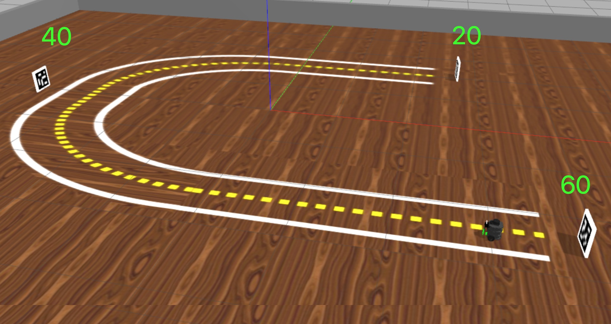

# Robótica Computacional 2020.2

[Mais orientações no README](./README.md)

## Prova P2 AF

**Você deve escolher somente 3 questões para fazer.**

Nome:_______________

Questões que fez:____________

Observações de avaliações nesta disciplina:

* Inicie a prova no Blackboard para a ferramenta de Proctoring iniciar. Só finalize o Blackboard quando enviar a prova via Github classroom
* Durante esta prova vamos registrar somente a tela, não a câmera nem microfone
* Ponha o nome no enunciado da prova no Github
* Tenha os repositórios https://github.com/Insper/robot202/ ,  https://github.com/arnaldojr/my_simulation e https://github.com/arnaldojr/mybot_description.git  atualizados em seu `catkin_ws/src` .
* Você pode consultar a internet ou qualquer material, mas não pode se comunicar com pessoas ou colegas a respeito da prova
* Todos os códigos fornecidos estão executando perfeitamente. Foram testados no SSD da disciplina
* Teste sempre seu código
* Entregue código que executa
* Faça commits e pushes frequentes no seu repositório (tem dicas [no final deste arquivo](./inst
rucoes_setup.md))
* Esteja conectado no Teams e pronto para receber calls do professor e da equipe. 
* Avisos importantes serão dados no chat da prova no Teams
* Permite-se consultar qualquer material online ou próprio. Não se pode compartilhar informações com colegas durante a prova
* Faça commits frequentes. O primeiro a enviar alguma ideia será considerado autor original
* A responsabilidade por ter o *setup* funcionando é de cada estudante
* Questões de esclarecimento geral podem ser perguntadas no chat do Teams
* Se você estiver em casa pode fazer pausas e falar com seus familiares, mas não pode receber ajuda na prova.
* É proibido colaborar ou pedir ajuda a colegas ou qualquer pessoa que conheça os assuntos avaliados nesta prova.
* Os exercícios admitem diversas estratégias de resolução. A prova de cada aluno é única

Existe algumas dicas de referência rápida de setup [instrucoes_setup.md](instrucoes_setup.md)

**Integridade Intelectual**

Se você tiver alguma evidência de fraude cometida nesta prova, [use este serviço de e-mail anônimo](https://www.guerrillamail.com/pt/compose)  para informar ao professor.  Ou [este formulário](https://forms.gle/JPhqjPmuKAHxmvwZ9)

# Questões

## Questão 1  (3.33 pontos)

Você deve fazer um programa que lê código de cores de resistores de 4 bandas e apresenta sempre a leitura correta a partir do vídeo.

#### Orientações

Trabalhe no arquivo `q1/q1.py`. Este exercício **não precisa** de ROS. Portanto pode ser feito até em Mac ou Windows
                                                            
Simplificações:
* A faixa 2 vai estar sempre preta em todos os casos. Você não precisa detectar
* Na faixa 1 e na faixa 3 os valores 0, 1, 8 e 9 nunca ocorrem
* A tolerância da faixa 4 é sempre a mesma de $+-5\%$ e esta faixa sempre vai estar prata
* Os resistores estarão sempre na horizontal

|     |     |
| --- | --- |
| Faixa | Significado |
| Faixa 1 | Dezena (nunca 0-1-8-9) |
| Faixa 2 | Unidade (sempre preto) |
| Faixa 3 | Multiplicador (nunca 0-1-8-9) |
| Faixa 4 | Tolerância sempre cinza |

Conforme você deve ter visto nas disciplinas de *Instrumentação e Medição* e *Acionamentos Elétricos* 

Dica:  a função `sorted` do Python aceita uma função de ordenação.

Você vai notar que este programa roda o vídeo `resistores.mp4`. Baixe o vídeo [neste endereço](https://github.com/Insper/robot20/raw/master/media/resistores.mp4)

#### O que você deve fazer:

Escrever sobre a janela um número indicando o valor do dado presente na imagem.  O

Quando não houver nada seu programa não precisa escrever coisa alguma.  

|Resultado| Conceito| 
|---|---|
| Não executa | zero |
| Segmenta todas as cores relevantes | 1.0|
| Vai um nível além da segmentação guardando em variáveis onde estão as regiões de cada cor  | 2.0|
| Mostra cálculo de resistência certo a maioria das vezes | 2.75 |
| Resultados perfeitos | 3.33|

Casos intermediários ou omissos da rubrica serão decididos pelo professor.

## Questão 2  (3.33 pontos)

Você precisa desenvolver um programa que avalia tabuleiros de jogo da velha.

Regras:
* Caso ninguém tenha vencido, seu programa deve imprimir na tela a mensagem `Sem vencedor`
* Caso o time que está com os círculos tenha vencido, deve imprimir **BOLINHAS VENCEM**
* Caso o time que está com o X tenha vencido, deve imprimir **X VENCEM**
* Caso o tabuleiro mostre que ambos os times estão em posição vitoriosa, deve imprimir os dois

Além de imprimir **na tela** quem venceu, precisa imprimir **na tela ou no terminal** uma explicação de quais casas foram ocupadas para permitir a vitoria

Exemplo: 

Um possível tabuleiro:

</img>

Considere que os índices são assim

</img>

**Desta forma, para o exemplo acima, a saída na tela seria:*

BOLINHAS vencem

**Na tela ou no console:**

BOLINHAS vencem. Posição: `(2,0), (1,1), (0,2)``

#### Orientações

Trabalhe no arquivo `q2/q2.py`. Este exercício **não precisa** de ROS. Portanto pode ser feito até em Mac ou Windows

Você vai notar que este programa roda o vídeo `jogovelha.mp4`. Baixe o vídeo [neste endereço](https://github.com/Insper/robot20/raw/master/media/jogovelha.mp4)

#### O que você deve fazer:

Dica: Pode ser interessante rever filtros lineares e detectores de cantos. Mas dá para resolver sem este recurso

|Resultado| Conceito| 
|---|---|
| Não executa | zero |
| Segmenta ou filtra a imagem baseado em cores ou canais da imagem e produz output visual| 0.6|
| Identifica um dos elementos X ou O corretamente com output claro | 1.3|
|Identifica o outro corretamente com output claro| 2.1 |
| Dá resultados mas não está perfeito | 2.6 |
| Resultados perfeitos | 3.33|

Casos intermediários ou omissos da rubrica serão decididos pelo professor.

## Questões de ROS

**Atenção: ** 

Para fazer estra questão você precisa ter o `my_simulation` e o `mybot_description` atualizado.

    cd ~/catkin_ws/src
    cd my_simulation
    git stash
    git pull

Ou então se ainda não tiver:

    cd ~/catkin_ws/src
    git clone https://github.com/arnaldojr/my_simulation.git

Para o mybot_description:

    cd ~/catkin_ws/src
    cd mybot_description
    git stash
    git pull

Ou então se ainda não tiver:

    cd ~/catkin_ws/src
    git clone https://github.com/arnaldojr/mybot_description

Em seguida faça o [catkin_make](./instrucoes_setup.md). 

## Questão 3

Para executar o cenário, faça:

    roslaunch my_simulation pista_u.launch

Seu robô está num cenário como o que pode ser visto na figura: 

</img>

#### O que é para fazer

Faça o robô seguir a pista amarela até encontrar o ID 20. Quando ele encontrar o ID 20 deve levantar as mãos para cima e começar a girar ao redor de seu próprio eixo. 

Você e seus colegas podem reusar o próprio projeto. 

**Mas não podem se comunicar nem colaborar durante a prova**

#### Detalhes de como rodar

O código para este exercício deve estar em: `p2_202/scripts/Q3.py`

Para rodar, recomendamos que faça:

    roslaunch my_simulation pista_u.launch

Depois o controlador do braço:

    roslaunch mybot_description mybot_control2.launch 	

Depois o seu código:

    rosrun p1_202 Q3.py

|Resultado| Conceito| 
|---|---|
| Não executa | 0 |
| Filtra o amarelo| 0.5|
| Analisa a imagem do amarelo e toma decisão para dirigir | 1.0|
| Segue pista | 2.0 |
|Detecta ARUCO | 2.5|
| Gira e mexe a garra no final | 3.33|

Casos intermediários ou omissos da rubrica serão decididos pelo professor.

## Questão 4 (3.33 pontos)

 width=50%></img>

Seu robô está no cenário visível abaixo:

    roslaunch turtlebot3_gazebo rampa.launch

#### O que é para fazer

Faça o robô seguir a pista e parar perto do bloco azul do final.

Cuidado que a pista é escorregadia.

Sensores que você pode usar: 
* Camera
* Laser 
* IMU

#### Detalhes de como rodar

O código para este exercício está em: `p1_202/scripts/Q4.py`

Para rodar, recomendamos que faça:

    roslaunch turtlebot3_gazebo turtlebot3_empty_world.launch

Depois:

    rosrun p1_202 Q4.py

|Resultado| Conceito| 
|---|---|
| Não executa | 0 |
| Faz o robô chegar ao fim em malha aberta - só com velocidades | 1.0 |
| Usa algum sensor para alinhar o robô | 2.0 |
| Usa mais de um sensor para alinhar e parar  mas o resultado não é perfeito | 2.8|
| Funciona perfeitamente | 3.33|

Casos intermediários ou omissos da rubrica serão decididos pelo professor.
